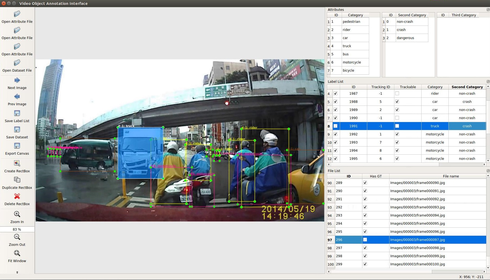

Video Object Annotation Interface
==================================

This work is based on [LabelImg](https://github.com/tzutalin/labelImg).

It is written in Python and uses Qt for its graphical interface.

Annotations are saved as Json files in MS-COCO format.

Installation
------------------

    sudo apt-get install pyqt5-dev-tools
    
    sudo pip3 install -r requirements.txt
    
    make qt5py3
    
    python3 main.py

Citation
--------------

Please cite the following paper: 

    @inproceedings{ltnghia-wacv2020,
      author = {Trung-Nghia Le and Akihiro Sugimoto and Shintaro Ono and Hiroshi Kawasaki},
      title = {Semantic Instance Meets Salient Object: Study on Video Semantic Salient Instance Segmentation},
      booktitle = {Toward Interactive Self-Annotation For Video Object Bounding Box: Recurrent Self-Learning And Hierarchical Annotation Based Framework},
      year = {2020}
    }

License
------------------
Free software: [MIT license](https://github.com/ltnghia/Object_Annotation_Interface/blob/master/LICENSE).

Contact: [Trung-Nghia Le](https://sites.google.com/view/ltnghia).
